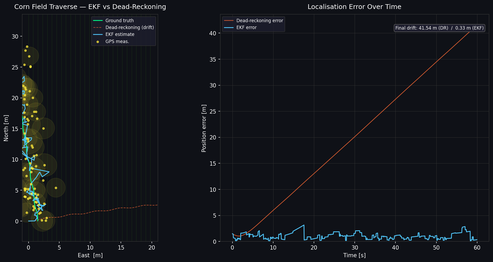

# field_nav — Agricultural Field Robot Autonomy Stack

A ROS2-based autonomy stack for navigating crop rows in unstructured outdoor fields.  
Built in Python with real-time performance in mind and designed to run on embedded hardware (NVIDIA Jetson).

---

## System Architecture

```
┌─────────────────────────────────────────────────────────────────┐
│                        Sensor Layer                             │
│   /robot/odom (encoders)     /robot/gps/fix     /camera/image   │
└──────────┬──────────────────────┬───────────────────┬───────────┘
           │                      │                   │
           ▼                      ▼                   ▼
┌──────────────────┐   ┌──────────────────┐  ┌────────────────────┐
│  EKF Localizer   │   │  EKF Localizer   │  │  Crop Row Detector │
│                  │◄──┤  (update step)   │  │                    │
│  State: [x,y,θ]  │   │  GPS @ ~2 Hz     │  │  ExG mask → Hough  │
│  Predict @ 50 Hz │   └──────────────────┘  │  → deviation [m]   │
└────────┬─────────┘                          └─────────┬──────────┘
         │                                              │
         │  /ekf/odom                  /crop_row/deviation
         │                             /crop_row/heading
         └──────────────┬──────────────────┘
                        ▼
             ┌─────────────────────┐
             │  Row Following      │
             │  Planner            │
             │                     │
             │  Stanley Controller │
             │  δ = ψ_e + atan(ke/v)│
             └────────┬────────────┘
                      │ /cmd_vel
                      ▼
              [ Robot Base ]
```

## Nodes

### `ekf_localizer`
Extended Kalman Filter fusing wheel odometry with sparse GPS fixes.

- **State**: `[x, y, θ]` in a flat local East-North frame
- **Predict**: non-linear differential-drive motion model @ 50 Hz
- **Update**: GPS position at ~2 Hz with outlier-safe innovation gating
- Publishes `PoseWithCovarianceStamped` + `Odometry` for nav2 compatibility

### `crop_row_detector`
OpenCV vision pipeline for detecting crop row centre from a forward-facing camera.

1. ROI crop (lower half, removes sky)
2. Excess Green index (ExG = 2G − R − B) → vegetation mask
3. Canny edges + Hough line transform
4. Left/right line classification → row centre estimation
5. Stanley-compatible `deviation [m]` and `heading_error [rad]` output

### `row_following_planner`
[Stanley method](https://ai.stanford.edu/~gabeh/papers/hoffmann_stanley_IJRR08.pdf) lateral controller for smooth row-following.

```
δ = ψ_e + arctan(k · e / (v + ε))
```
- Stable at near-zero speeds (softened denominator `ε`)  
- Safety watchdog: stops if no row detected for > 1.5 s

---

## Standalone Demo (no ROS2 needed)

```bash
pip install numpy matplotlib
python sim/standalone_ekf_demo.py
```

Simulates a 60-second field traverse with odometry noise and sparse GPS,
showing the EKF dramatically outperforming pure dead-reckoning.



---

## Build & Run (ROS2 Humble / Iron)

```bash
# Clone into your workspace
cd ~/ros2_ws/src
git clone https://github.com/YOUR_USERNAME/field_nav_stack.git

# Build
cd ~/ros2_ws
colcon build --packages-select field_nav

# Source
source install/setup.bash

# Launch full stack
ros2 launch field_nav field_nav.launch.py
```

### Topic remappings
Edit `field_nav.launch.py` or pass at runtime to match your hardware:
```
/robot/odom         → your encoder odometry topic
/robot/gps/fix      → your GPS driver topic
/robot/camera/...   → your camera topic
```

---

## Configuration

All parameters live in `config/params.yaml`:

| Parameter | Default | Description |
|---|---|---|
| `gps_origin_lat/lon` | Waterloo, ON | Local frame origin |
| `target_speed_mps` | 0.5 | Forward speed |
| `stanley_gain_k` | 1.2 | Lateral controller gain |
| `camera_height_m` | 0.55 | Lens height above ground |
| `hough_threshold` | 60 | Minimum Hough line votes |

---

## Roadmap

- [ ] SLAM integration (cartographer / slam_toolbox) for GPS-denied operation  
- [ ] YOLO v8 plant health classifier node  
- [ ] End-of-row detection + headland turn planner  
- [ ] Sim2real: Gazebo world with corn row meshes  
- [ ] CAN bus interface for motor controller  

---

## Dependencies

| Package | Version |
|---|---|
| ROS2 | Humble or Iron |
| Python | ≥ 3.10 |
| numpy | ≥ 1.24 |
| opencv-python | ≥ 4.8 |
| cv_bridge | (from ROS2) |

---

*Built as a demonstration of a field robot autonomy stack targeting agricultural row-crop navigation.*
